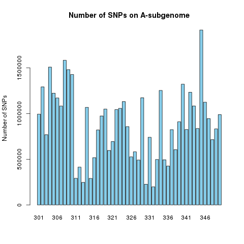

## Finger Millet Genomic Analysis
Céline Bitter 
(Supervior: Dr. Masaomi Hatekayama)

---

### Introduction

---

#### Objective
@ul[list-square-bullets list-spaced-bullets text-08](false)
- Allopolyploidie poses many challenges in finding true variants, due to the high number of homeologs between the subgenomes
- Finger millet is a tetrapolyploid crop species, with subgenome A and subgenome B
- EAGLE-RC is able to map reads to the subgenomes seperately and evaluates the likelihood of the data under a given hypothesis
@ulend

---

#### Methods - planning the pipeline

---

#### Methods - EAGLE-RC

 
 

---

####  Methods - applying the pipeline

---

#### Results (before EAGLE-RC)

 
 
 

 
 

---

#### Results (after EAGLE-RC)

 
 
 

 
 

---
@title[Results (Number of SNPs, GATKv4)]

@snap[north span-50 text-center]
#### Results (Number of SNPs)
@snapend

@snap[west span-50]

@snapend

@snap[east span-50]

@snapend

---
@title[Results (Number of SNPs, GATKv4)]

@snap[north span-50 text-center]
#### Discussion
@snapend

######## before EAGLE-RC

 
 

######## after EAGLE-RC

 
 

---

#### Challenges vs what I have learned
@ul[list-square-bullets list-spaced-bullets text-08](false)
- Bottelneck in pipeline (BWA, EAGLE-RC, GATK)
- Limited disc space on server
- Planning and organisation
- Github / GitPitch 
- Application of a functional genomics workflow
@ulend

---

#### Outlook
@ul[list-square-bullets list-spaced-bullets text-08](false)
- Finish the pipeline (from EAGLE-RC to BEAGLE)
- Start pipeline for remaining 3 groups 
- At the beginning of pipeline, state what could go wrong and name workarounds
- Compare sequencing data to linguistic data  
@ulend

---
### Acknowledgement
@ul[list-square-bullets list-spaced-bullets text-10](false)
- Prof. Kentaro Shimizu
- Dr. Masaomi Hatekayama
- Dr. Chiara Barbieri
- And to everyone somehow involved in this project!
@ulend
@snap[text-14]
Thanks everyone for your attention! 
@snapend

